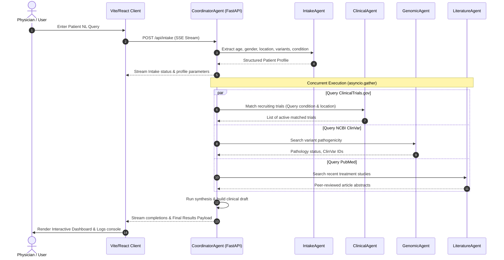

# ClinicaAgent 🧬🔍
> **Intelligent Multi-Agent Clinical & Genomic Intelligence Platform**  
> *Built for the Kaggle "AI Agents: Intensive Vibe Coding Capstone Project" (Agents for Good Track)*

ClinicaAgent is an autonomous clinical matchmaking and genomic intelligence tool designed to help oncology professionals parse patient conditions, fetch pathogenicity reports from ClinVar, find active recruiting clinical trials, reference literature from PubMed, and generate signed, verified clinical reports.

---

## 🌟 The Pitch: Problem, Solution & Value

### The Core Problem
Oncologists and clinical researchers spend hours performing manual database lookups to match patients with genomic variants (such as *EGFR T790M*, *BRCA1*, or *BRAF V600E*) to active clinical trials, verifying mutation pathogenicity in ClinVar, and gathering peer-reviewed treatment studies from PubMed. This manual workflow is highly fragmented, slow, and delays critical patient care.

### The Solution: ClinicaAgent
ClinicaAgent automates this entire pipeline using an **autonomous multi-agent orchestration system**. A physician inputs a patient's profile in natural language (e.g., *"58yo male diagnosed with non-small cell lung cancer with EGFR T790M mutation in California"*). ClinicaAgent then parses, queries, and synthesizes data from multiple live databases concurrently, presenting a clean interactive dashboard with a **Doctor Verification Hub** for final clinical sign-off.

### Why it is Unique & High-Value
1. **Zero LLM API Fees**: Built entirely using structured natural language parsing and direct database APIs. Highly performant, predictable, and 100% free to scale.
2. **Concurrent Multi-Agent Flow**: Agents execute tasks concurrently using python's `asyncio`, keeping execution fast and streaming step-by-step progress logs to the user.
3. **Doctor-in-the-Loop Hub**: Doctors can toggle "Verification Mode" to check/exclude matched trials/genomics/literature, edit the AI-generated report, and download a professional, styled PDF with signature blocks.

---

## 🏗️ Multi-Agent Architecture

The coordinator orchestrates five specialized agent roles:



---

## ⚙️ Tech Stack & Key Course Concepts

- **Frontend**: React (Vite), Lucide Icons, Vanilla CSS (harmonious HSL color scheme, glassmorphism, responsive dashboard layout).
- **Backend**: FastAPI, Server-Sent Events (SSE) Streaming, `asyncio`, ReportLab (dynamic PDF generation).
- **APIs**: ClinicalTrials.gov API v2, PubMed API (NCBI E-utilities), ClinVar API (NCBI E-utilities).
- **Key Course Concepts Demonstrated**:
  - **Multi-Agent System**: Structured coordination and concurrent sub-agents.
  - **Deployability**: Complete build files ready for separate Render (backend) and Vercel (frontend) cloud hosting.
  - **Security & Fallbacks**: Clinical trial search has an automatic fallback to PubMed clinical trial records if API v2 is blocked or rate-limited.

---

## 🚀 Setup & Running Locally

### Prerequisites
- Python 3.10+
- Node.js 18+

### 1. Run the Backend
1. Navigate to the project root directory.
2. Create and activate a Python virtual environment:
   ```bash
   python -m venv .venv
   .venv\Scripts\activate      # On Windows
   source .venv/bin/activate    # On macOS/Linux
   ```
3. Install dependencies:
   ```bash
   pip install -r backend/requirements.txt
   ```
4. Start the FastAPI development server:
   ```bash
   python -m backend.main
   ```
   The backend will run at `http://127.0.0.1:8000`.

### 2. Run the Frontend
1. Open a new terminal and navigate to the `frontend` folder:
   ```bash
   cd frontend
   ```
2. Install Node packages:
   ```bash
   npm install
   ```
3. Run the Vite development server:
   ```bash
   npm run dev
   ```
   The frontend will run at `http://localhost:5173`. Open this URL in your browser.

---

## 🌐 Live Cloud Deployment Guide

To deploy this project for free and get a live public link, follow these instructions:

### Step 1: Push to GitHub
Initialize git in the project root, commit all files, and push to a new GitHub repository:
```bash
git init
git add .
git commit -m "Initial commit of ClinicaAgent platform"
# Create repository on github.com and link it:
git remote add origin <your-github-repo-url>
git branch -M main
git push -u origin main
```

### Step 2: Deploy Backend to Render (Free)
1. Go to [Render](https://render.com) and log in with GitHub.
2. Click **New** -> **Web Service** -> **Build and deploy from a Git repository**.
3. Select your repository and configure:
   - **Name**: `clinica-agent-api`
   - **Runtime**: `Python`
   - **Build Command**: `pip install -r backend/requirements.txt`
   - **Start Command**: `uvicorn backend.main:app --host 0.0.0.0 --port $PORT`
4. Click **Deploy Web Service** and copy the live URL (e.g., `https://clinica-agent-api.onrender.com`).

### Step 3: Deploy Frontend to Vercel (Free)
1. Go to [Vercel](https://vercel.com) and log in with GitHub.
2. Click **Add New** -> **Project** and import your repository.
3. Configure the settings:
   - **Root Directory**: `frontend`
   - **Framework Preset**: `Vite`
   - **Environment Variables**: Add a variable with:
     - **Key**: `VITE_API_URL`
     - **Value**: Your Render backend URL (e.g. `https://clinica-agent-api.onrender.com` - *without a trailing slash*).
4. Click **Deploy**. Vercel will host your site and generate a live URL (e.g., `https://clinica-agent.vercel.app`).
